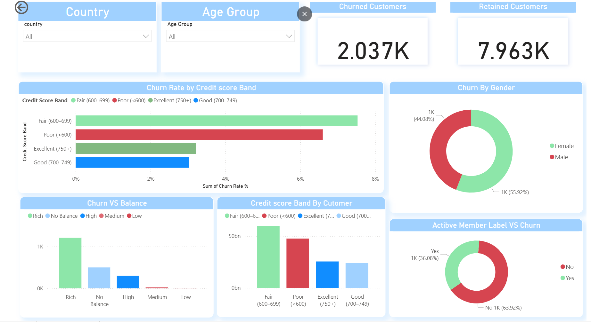
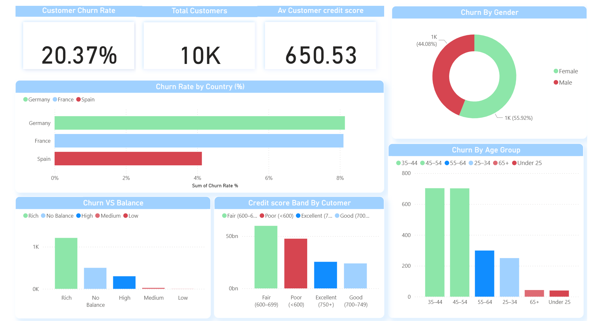

# 🏦 Bank Customer Retention Dashboard – Power BI

## 📘 Project Overview
This project analyzes customer churn for a retail bank to identify patterns, key risk factors, and actionable insights that help improve customer retention.  
It demonstrates **end-to-end business intelligence** — from data modeling with DAX to interactive visualization in Power BI.

## 📊 Dashboard Preview
### Page 1 – Overview

### Page 2 – Insights


## 🎯 Objective
To uncover the main drivers of customer churn and provide insights that can help the bank retain valuable customers.  

**Key Business Questions:**
1. What is the overall churn rate among bank customers?
2. Which customer segments are most likely to churn?
3. How do credit score, balance, and activity level affect churn?
4. What demographic or financial factors influence retention?

## 🧩 Dataset Information
**Dataset:** Bank Customer Churn Dataset (10,000 records)

| Column | Description |
|---------|--------------|
| customer_id | Unique customer identifier |
| credit_score | Financial credit score |
| country | Country of residence |
| gender | Male / Female |
| age | Customer age |
| tenure | Years with the bank |
| balance | Account balance |
| products_number | Number of products owned |
| credit_card | Whether the customer owns a credit card (1=Yes, 0=No) |
| active_member | Active bank member status (1=Yes, 0=No) |
| estimated_salary | Estimated annual salary |
| churn | Target variable (1=Exited, 0=Retained) |

## ⚙️ Power BI Development Process
### 1️⃣ Data Preparation (Power Query)
- Renamed columns for clarity  
- Changed data types (e.g., balance to decimal, country to text)  
- Created readable categorical columns:  
  - Churn Label (Exited / Retained)  
  - Age Group  
  - Balance Group  
  - Credit Score Band  
  - Tenure Group

### 2️⃣ DAX Measures
```
Total Customers = COUNTROWS('Bank_Customer_Churn_Prediction')

Churned Customers =
CALCULATE([Total Customers],
'Bank_Customer_Churn_Prediction'[churn] = 1)

Churn Rate % =
DIVIDE([Churned Customers], [Total Customers], 0)

Avg Credit Score = AVERAGE('Bank_Customer_Churn_Prediction'[credit_score])
Avg Balance = AVERAGE('Bank_Customer_Churn_Prediction'[balance])
```

### 3️⃣ Visualizations
| Section | Visualization Type | Description |
|----------|--------------------|--------------|
| KPIs | Cards | Churn Rate %, Total Customers, Avg Credit Score, Churned & Retained Customers |
| Demographics | Donut Charts | Churn by Gender, Active Member Status |
| Geography | Bar Chart | Churn by Country |
| Financial Analysis | Bar & Column Charts | Churn vs Balance, Credit Score Band, Salary Band |
| Slicers | Filters | Country, Age Group for interactivity |

## 📈 Key Insights
- **Churn Rate:** 20.37% (≈ 2,037 out of 10,000 customers)
- **Highest churn** observed among customers with:
  - Fair (600–699) and Poor (<600) credit scores  
  - Inactive members  
  - Medium-to-low balance accounts  
- **Lower churn** among:
  - Active members with high balances  
  - Customers with Excellent credit (750+)

## 🧠 Recommendations
1. Improve engagement with inactive members through loyalty programs.  
2. Target churn prevention campaigns for customers with credit scores <700.  
3. Offer balance incentives for low-balance accounts.  
4. Reward tenure and activity to retain high-value customers.  

## 💻 Tools Used
- Power BI Desktop – Data visualization & dashboard creation  
- Power Query – Data cleaning & transformation  
- DAX (Data Analysis Expressions) – Calculated measures and KPIs  
- Microsoft Excel / CSV – Dataset source  

## 📣 Author
**👤 Mohamed Abdullahi Kasim**  
Data Scientist & Software Engineer | Nova Technologies (Somalia)  
📍 Somalia | 🌐 [LinkedIn Profile](https://www.linkedin.com/in/mohamed-abdullahi-kasim-12b9a732a/)

## 🏁 Tags
#PowerBI #DataAnalytics #CustomerChurn #BusinessIntelligence #DataScience #BankingAnalytics #MohamedAbdullahiKasim
"# Bank_Customer_Retention_Dashboard" 
